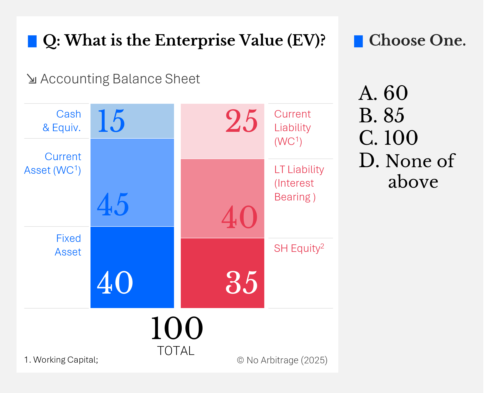
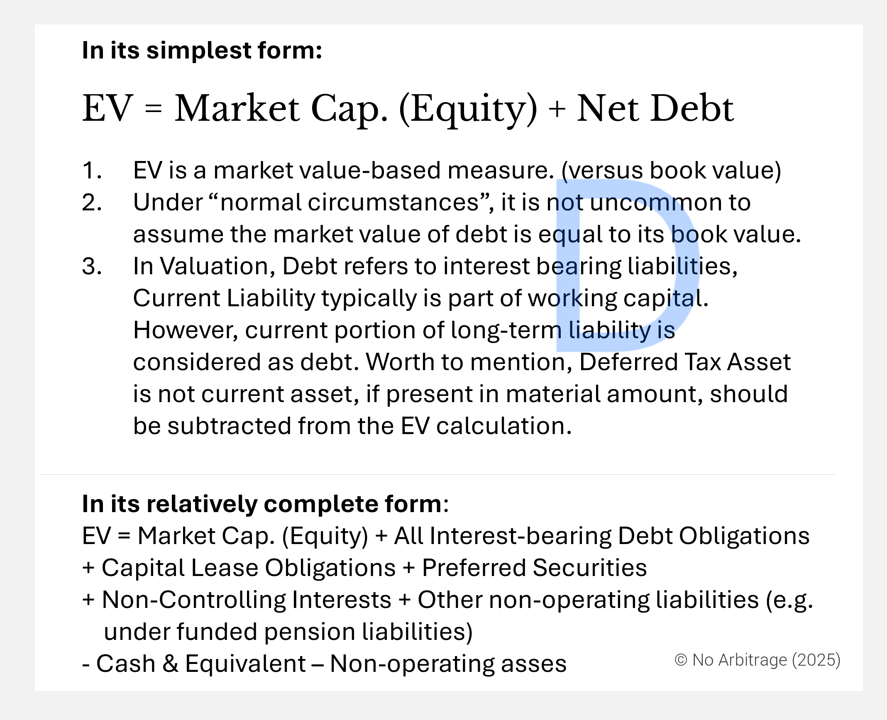


Value means proven ability to generate future cash streams. Period.


This is a series of posts about fundamental concepts of value concept in corproate finance. I will be taking you to go through a series of fundamental basic however important concepts in finance, through small pieces of posts.

### Introduction
Let's take a look at this question below.

So often, people use enterprise value, firm value, and market capitalisation (or market cap) interchangeably. However, these terms represent distinct financial concepts, and understanding their differences is crucial for accurate valuation analysis.

So the answer is here.

I suspect if the accounting value equals to  market value here, many would choose B.85, which remains to be a wrong answer. Because the operating liabulities should be used to offset operating assets, to assess the true capital requirement for the busienss

### The Philosophy of Value

In economic terms, value is often defined as utility or pleasure. Yet, human nature leans towards immediate gratification over future benefits, struggling to reconcile present desires with long-term goals. To bridge this gap, we assign meaning to waiting—we call it the intrinsic time value of money. At that moment, finance was born.

Finance, as a discipline, is philosophically warm and illuminating, though often ambiguous. Many things in life could bear the name 'value,' yet finance scholars sought precision. They defined value as the "ability to generate cash." But paradoxically, in their attempt to remove ambiguity, they did not eliminate it entirely.

### Breaking Down Value Measures

Enterprise Value,  Firm Value and Equity value are infamous terms in world of corporate finance. There are a few very similar concept to these.

While some consider firm value to be another term for enterprise value, I see a distinction. Firm value encompasses all of a company's assets, including cash and other non-core, non-operating assets. Enterprise value, on the other hand, measures a business's ability to generate cash from its core operations. Market capitalisation, meanwhile, represents the current market value of a company’s equity.

| Formula | Scope | Formula |
| --- | --- | --- |
| Market Capitalisation (Equity) | Measures the current market value of equity. | Shares Outstanding x Share Price |
| Enterprise Value | Measures a business's ability to generate cash through core operating activities | EV = Market Cap + Debt - Cash |
| Firm Value | Measures the total resources a company controls, including non-core assets. | Enterprise Value + Cash + Non-core Non-Operating Assets |

Note the EV Extended formula :


**EV** =  
Equity Market Cap 
 [+] Interest-bearing debt 
 [+] Capital lease obligations
 [+] Preferred securities
 [+] Non-controlling interests 
  [+] Other non-operating liabilities 
 [–] Cash & equivalent
 [–] Non-operating asses

Non-Operating Liabilities e.g.under funded pension liabilities.
  By understanding these distinctions, investors and analysts can make more informed decisions, ensuring that they evaluate businesses based on the right financial lens.

### Relationship with Cash Flows

#### Free Cash Flow to Firm

FCFF = EBIT (1- ETR) + Deferred Tax  + Non-cash Items  – △NWC – Net CapEx

Where:

* EBIT (1- ETR) = Net Income + Interest x (1-ETR)
* ETR = Effective Tax Rate; EBIT (1-ETR) = EBIT - Corporate Tax
* Net CapEx = CapEx -  D&A
* △NWC = Incrase in Working Capital
* Deferred Tax = + DTL - DTA (we can discuss this in another post.)

FCFE = FCFF + CF from net debt

Where:

CF from Net Debt =  - Debt replay + Debt Issuance - Interest Payment

### Negative Equity Value

Under the following scenarios, a negative equity value is possible:

| Scenario | Explaination |
| --------| ---------|
| Accumulated Losses | If a company consistently incurs losses, its retained earnings will become negative, reducing shareholders' equity. Over time, if losses exceed the initial capital invested, equity can turn negative.|
| High Debt Levels | If a company takes on excessive debt, its liabilities can grow faster than its assets, leading to negative equity. |
| Share Buybacks|  If a company repurchases its own shares (treasury stock) at a high price, it reduces shareholders' equity. If this reduction is large enough, equity can become negative.|
| Asset Write-Downs | If a company writes down the value of its assets (e.g., due to impairment), total assets decrease, which can lead to negative equity.|
| Startups or Early-Stage Companies | New companies may have negative equity if they have not yet generated profits and rely heavily on debt or external funding. |

### Reference
1. A Tangled Web We Weave: Enterprise, Firm & Equity Values by Aswath Damodaran [🔗](https://pages.stern.nyu.edu/~adamodar/pdfiles/eqnotes/webcasts/multiplecalc/multiplecalc.pdf)